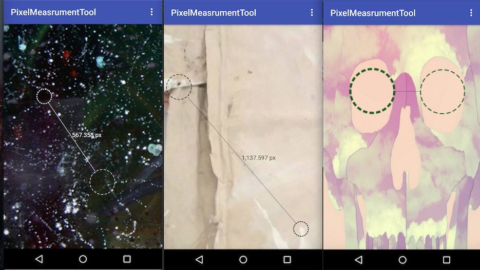

# Android-PixelMeasuringTool
A imageView with a tool to calculate the pixel between items in the picture

## Download

via Gradle:

    dependencies {
        compile 'com.zekapp.library:pixelmeasuringview:1.0.8'
    }
    
## Usage

    <app.com.pixelmeasuringview.PixelMeasuringView
        xmlns:measure="http://schemas.android.com/apk/res-auto"
        android:id="@+id/image"
        android:layout_width="match_parent"
        android:layout_height="match_parent"
        android:layout_centerInParent="true"
        android:scaleType="centerCrop"
        android:background="@drawable/background"
        measure:is_line_all_visible="true"
        measure:is_measure_text_visible="true"
        measure:circles_color="@android:color/black"
        measure:ruler_color="@android:color/black"
        />

## Getting Pixel Programmatically

        @Override
        protected void onCreate(Bundle savedInstanceState) {
            super.onCreate(savedInstanceState);
            setContentView(R.layout.activity_main);
    
            PixelMeasuringView measure = (PixelMeasuringView)findViewById(R.id.image);
            measure.setCallback(new PixelMeasuringCallback() {
                @Override
                public void distanceBetweenCircles(float distance) {
                   
                }
            });
        }

## License

        Copyright (C) 2015 Zeki Guler
        Copyright (C) 2011 The Android Open Source Project
        
        Licensed under the Apache License, Version 2.0 (the "License");
        you may not use this file except in compliance with the License.
        You may obtain a copy of the License at
        
           http://www.apache.org/licenses/LICENSE-2.0
        
        Unless required by applicable law or agreed to in writing, software
        distributed under the License is distributed on an "AS IS" BASIS,
        WITHOUT WARRANTIES OR CONDITIONS OF ANY KIND, either express or implied.
        See the License for the specific language governing permissions and
        limitations under the License.
